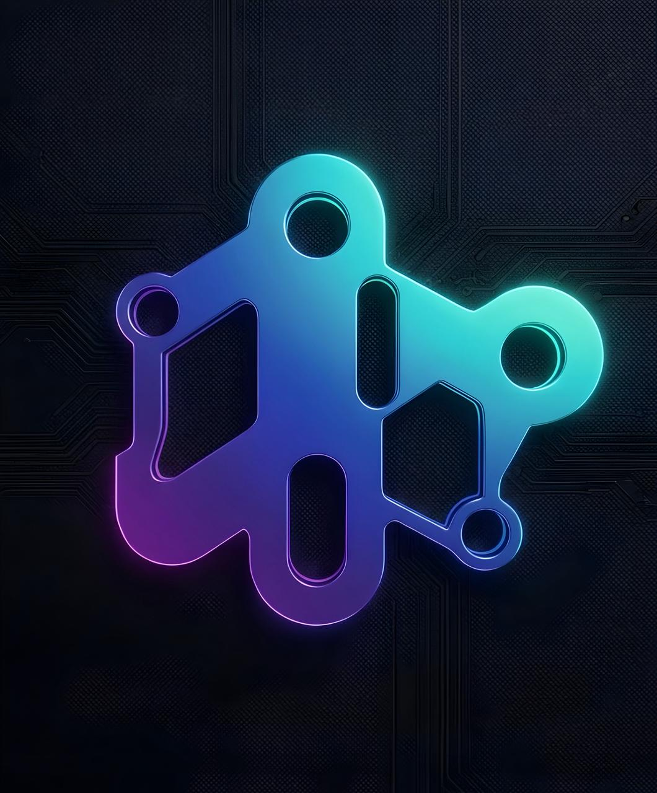

<div align="center">
  
  <h1>LeverixPro</h1>
  <p><strong>AI-Powered Autonomous Perpetual Futures Terminal on Solana</strong></p>

  [](./LICENSE)
  [](https://nextjs.org)
  [](https://solana.com)
  [](https://x.ai)
  [](https://leverixpro.com)
  [](https://x.com/leverixpro)

  <br/>

  **[🚀 Launch App](https://leverixpro.com)** · **[📖 Docs](https://leverixpro.com/docs)** · **[🐦 X / Twitter](https://x.com/leverixpro)** · **[💻 GitHub](https://github.com/leverixpro/leverixpro)**

</div>

---

## What is LeverixPro?

LeverixPro is a fully open-source, AI-powered decentralized trading terminal for **perpetual futures on Solana**. It combines a natural-language AI agent *(powered by xAI Grok-4)* with the proprietary **Aegis Defense Matrix** — an autonomous anti-liquidation system that protects user capital 24/7.

> Think of it as a Bloomberg Terminal for DeFi, but instead of a trader behind the screen, there's an autonomous AI agent managing risk in real-time.

---

## Features

| Feature | Status |
|---|---|
| 🤖 **xAI (Grok-4) Agent Terminal** — Natural language trade execution | ✅ Live |
| 🛡️ **Aegis Defense Matrix** — Anti-liquidation protection system | ✅ Active |
| 🔐 **Solana Wallet Connect** — Phantom, Solflare, and more | ✅ Live |
| 💼 **Agent Vault** — Deposit SOL for autonomous AI trading | ✅ Live |
| 📊 **TradingView Live Chart** — Professional chart with 15m precision | ✅ Live |
| 📈 **Real-time Price Ticker** — Live Solana ecosystem token data | ✅ Live |
| 🔁 **Auto TP/SL Engine** — Take-profit / Stop-loss via backend | ✅ Live |
| 📡 **Social Feeds** — KOL trade signals & copy-trading | ✅ Live |
| 🔄 **P2P Exchange** — Decentralized peer-to-peer futures | 🚧 Coming Soon |

---

## Tech Stack

| Layer | Technology |
|---|---|
| **Frontend** | Next.js 16 (App Router), Tailwind CSS v4, Framer Motion |
| **AI Agent** | [xAI API](https://x.ai) — Grok-4-1-Fast-Reasoning |
| **Blockchain** | Solana Web3.js, Wallet Adapter (Phantom / Solflare) |
| **Execution** | [Jupiter v6](https://jup.ag) Perps — zero-slippage swap routing |
| **RPC Node** | [Helius](https://helius.dev) — Institutional-grade Solana RPC |
| **Database** | PostgreSQL with Row Level Security |
| **Charts** | [TradingView](https://tradingview.com) Advanced Chart Widget |
| **Hosting** | VPS — 24/7 Always-on autonomous operation |

---

## Getting Started

### 1. Clone the repository

```bash
git clone https://github.com/leverixpro/leverixpro.git
cd leverixpro
```

### 2. Install dependencies

```bash
npm install
```

### 3. Configure environment variables

```bash
cp .env.local.example .env.local
```

Open `.env.local` and fill in your keys:

| Variable | Description |
|---|---|
| `XAI_API_KEY` | Your xAI API key for the Grok AI agent — get it at [x.ai](https://x.ai) |
| `NEXT_PUBLIC_SUPABASE_URL` | Your database project URL |
| `NEXT_PUBLIC_SUPABASE_ANON_KEY` | Database anon public key |
| `SUPABASE_SERVICE_ROLE_KEY` | Database service role key (backend only, never exposed to client) |
| `NEXT_PUBLIC_HELIUS_RPC_URL` | Institutional Solana RPC node URL |

> ⚠️ **Never commit `.env.local` to Git.** It is already excluded by `.gitignore`. Copy `.env.local.example` as a reference.

### 4. Set up the database

Copy the contents of [`supabase_schema.sql`](./supabase_schema.sql) into your Supabase SQL Editor and click **Run**. This creates:

- `profiles` — Linked to Solana wallet addresses
- `feeds` — Social posts with chart sharing & copy-trade payloads
- `orders` — Auto TP/SL execution queue managed by the AI agent
- `agent_wallets` — Custodial vault keypairs per user (server-side only)

### 5. Run locally

```bash
npm run dev
```

Visit [http://localhost:3000](http://localhost:3000)

---

## Architecture

```
User (Phantom Wallet)
        │
        ▼
  Next.js Frontend  ──────────────────────────────────────────┐
  [/trade]  [/vault]  [/feeds]  [/docs]  [/p2p]              │
        │                                                      │
        ▼                                                      │
  /api/chat  ──► xAI Grok-4 (OpenClaw NLP)                   │
        │              │                                       │
        │         Parses intent into:                          │
        │         { action, token, leverage, sizeUsd, tp, sl } │
        │                                                      │
        ▼                                                      │
  /api/trade ──► Aegis Defense Matrix                         │
                   │  Pre-flight checks:                       │
                   │  · Margin cap (< 80%)                     │
                   │  · Concurrent positions (max 3)           │
                   │  · ATR volatility filter                   │
                   │                                           │
                   ▼                                           │
            Jupiter v6 Perps                                   │
            (Best-price swap routing)                          │
                   │                                           │
                   ▼                                           │
            Solana On-Chain Transaction ◄────────────────────┘
                   │
                   ▼
         PostgreSQL Database
         (orders · feeds · agent_wallets)
```

---

## Aegis Defense Matrix

The **Aegis Defense Matrix** is LeverixPro's proprietary anti-liquidation core. Every trade passes through these mandatory rules before execution:

| Rule | Value | Description |
|---|---|---|
| `MAX_MARGIN_UTILIZATION` | **80%** | Collateral never exceeds 80% of vault balance |
| `HARD_LIQUIDATION_BUFFER` | **15%** | Auto force-close if within 15% of liquidation price |
| `VOLATILITY_ATR_THRESHOLD` | **2.5×** | Leverage auto-reduced during high ATR volatility |
| `DYNAMIC_TRAILING_SL` | **-3.0%** | Stop-loss always trails price — never static |
| `MAX_CONCURRENT_POSITIONS` | **3** | Capital diversification guard |
| `SCALE_OUT_LADDER` | **+25% / +50%** | Auto-harvests profits at first and second targets |

---

## OpenClaw Agent Architecture

The **OpenClaw** semantic extraction framework is what makes LeverixPro's AI uniquely capable:

1. **Parse** — Interprets natural language trade intent via xAI / Grok-4
2. **Validate** — Runs Aegis pre-flight checks (margin, ATR, concurrent positions)
3. **Route** — Calculates entry via 15-minute timeframe support/resistance analysis
4. **Execute** — Submits to `/api/trade` → Jupiter v6 → Solana on-chain

---

## Roadmap

| Phase | Status | Items |
|---|---|---|
| **Phase 1** | ✅ Live | Custodial Agent Vault, AI Terminal, Social Feeds, Jupiter Swap |
| **Phase 2** | 🔨 Building | 24/7 Auto TP/SL via VPS cron, Multi-token portfolio, Copy-trade |
| **Phase 3** | 📋 Planned | On-chain Smart Contract Vault, LEVERIX token on Pump.fun, Mobile PWA |

---

## Contributing

Pull requests are welcome. For major changes, please open an issue first to discuss what you would like to change.

```bash
# 1. Fork and clone
git clone https://github.com/leverixpro/leverixpro.git

# 2. Create a feature branch
git checkout -b feature/my-improvement

# 3. Commit your changes
git commit -m "feat: add my improvement"

# 4. Push and open a PR
git push origin feature/my-improvement
```

---

## License

**MIT License** — see [LICENSE](./LICENSE) for full terms.

---

## Links

| Resource | URL |
|---|---|
| 🌐 Website | [leverixpro.com](https://leverixpro.com) |
| 🐦 X / Twitter | [@leverixpro](https://x.com/leverixpro) |
| 💻 GitHub | [github.com/leverixpro/leverixpro](https://github.com/leverixpro/leverixpro) |
| 📖 Docs | [leverixpro.com/docs](https://leverixpro.com/docs) |
| ⚡ xAI | [x.ai](https://x.ai) |
| 🔵 Solana | [solana.com](https://solana.com) |
| 🪐 Jupiter | [jup.ag](https://jup.ag) |

---
